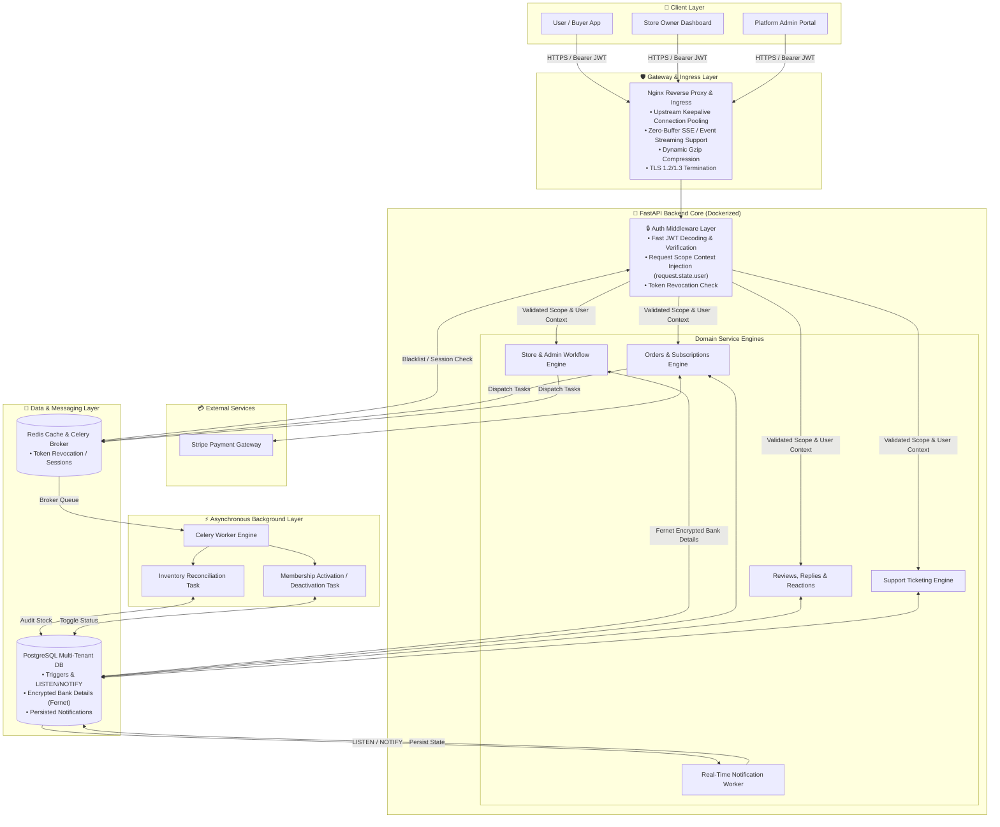

# 🚀 AtomicCommerce: High-Performance Multi-Tenant Engine


A heavy-duty, service-oriented FastAPI backend architected for enterprise-scale multi-tenant commerce, strict data isolation, and exceptional performance under high concurrent load.

---

## 🏗️ Core Architecture & Event Flow


---

## ✨ Features

*   **Multi-Tenant Marketplace**: Enforces absolute data isolation boundaries across independent vendor nodes, allowing separate brand networks to operate securely under a single, unified database schema.
*   **Stripe Subscriptions & Billing**: An asynchronous financial ledger core managing B2B/B2C multi-tier subscription states, trial/grace intervals, automated webhook processing, and credit proration.
*   **Warehouse Inventory**: Atomic stock engine enforcing strict concurrency controls to eradicate race conditions, warehouse drops, and product over-allocation.
*   **Real-Time Analytics**: High-signal metrics tracking layer engineered using low-overhead time-series ledger write logs to bypass expensive computational table lookups.
*   **Event-Driven Notifications**: Low-latency data reactivity using native PostgreSQL LISTEN/NOTIFY structures combined with async task broadcasting pipelines.
*   **Redis Caching**: Highly efficient Cache-Aside strategy serving intense catalog reads, pricing structures, and storefront snapshots directly from in-memory stores to bypass disk I/O.
*   **Celery Workers**: Offloads long-running application-level computations, metric compilations, transactional reporting, and automated subscription status checks out of the core request-response lifecycle.
*   **Media Uploads**: Chunk-streaming asset gateway that scans, validates MIME-types at the binary byte level, and writes straight to Supabase Storage Buckets to protect server memory.
*   **JWT Authentication**: Stateless verification workflow featuring Multi-Tenant Role-Based Access Control (RBAC) maps backed by a zero-reuse Refresh Token Rotation security policy.
*   **Customer Support Messaging (Ticketing System)**: A durable, multi-tenant ticketing and operational support routing layout. Tracks client issues with strict SLA expiration states, tenant boundary verification, and asynchronous agent assignment queues managed outside the core transaction paths.

---

## 📈 System Metrics & Scale

*   **110+ REST Endpoints**: Fully versioned, clean API paths covering multi-tenant billing portals, vendor marketplaces, real-time analytics dashboards, shopping carts, checkout logic, and advanced stock administration.
*   **20+ Service Modules**: Fully isolated domain modules following Service-Oriented Architecture (SOA) principles to eliminate circular imports and enforce a clear separation of concerns.
*   **20+ Database Tables**: A robust PostgreSQL relational schema complete with optimized composite indexes, write-ahead time-series logging, explicit cascading parameters, and foreign key boundaries.
*   **10+ Strict Enums**: Rigid state-machine tracking via Python/SQLAlchemy Enums (e.g., Subscription Status, Order states, Payment states, Account tiers, Analytics event types) ensuring type-safe processing at every interface.

---

## 💳 Enterprise Billing & Stripe Lifecycle Engine

The platform implements a production-grade, asynchronous financial ledger engine driven by a deeply integrated **Stripe API architecture** handling complex B2B/B2C payment lifecycles:

*   **Idempotent Webhook Processing**: A bulletproof webhook listening architecture protecting against duplicate events. State synchronization is guarded by unique event ledger validation to prevent double-processing.
*   **Comprehensive Subscription Lifecycles**: Fully handles automated provision state updates covering subscription creation, trial periods, grace periods, and clean sync on cancellations.
*   **Mid-Billing Cycle Tier Upgrades/Downgrades**: Formulated accurate proration charging structures, calculating immediate usage shifts and credit adjustments midway through subscription intervals seamlessly.
*   **One-Time Payments & Partial/Full Refunds**: Isolated transactional service endpoints engineered to settle explicit one-time order payments alongside secure refund handling logic that enforces programmatic ledger balance rollbacks.

---

## 📡 Transactional Streaming & Lifecycle Engine

The platform features an event-driven, low-latency infrastructure designed to capture high-signal commerce status updates and broadcast core operational events across multi-container instances:

*   **Reactive Lifecycle Triggers (LISTEN/NOTIFY)**: Millisecond data reactivity built on native PostgreSQL transactional layers. State mutations across critical transactional domains (e.g., successful orders, payment settling, subscription status changes, and membership upgrades) emit immediate async payloads via `NOTIFY`, completely bypassing application-level polling loops.
*   **Horizontal Redis Pub/Sub Fan-Out**: To scale across distributed ASGI container pools, a dedicated worker listener intercepts database notifications and pipes them into a Redis Pub/Sub distribution broker. This ensures multi-node synchronization, distributing lifecycle updates reliably to all connected tenant channels.
*   **Reactive Event Streaming (EventSourceResponse)**: Real-time user notifications, cart warnings, and order status tickers are fueled by a clean Server-Sent Events (SSE) protocol using `EventSourceResponse`. Clients maintain a lightweight, persistent, unidirectional HTTP connection for instantaneous event propagation.
*   **Buffered Event Ledger Persistence**: To protect database connection pools from high-concurrency spikes, transactional events pass through an in-memory micro-batching buffer. Events are held briefly in an execution queue and committed in optimized blocks, striking an ideal balance between low-latency network propagation and database performance.

---

## 🛠️ Engineering Highlights

*   **Asynchronous Architecture**: Built entirely on an ASGI worker pool loop using FastAPI and SQLAlchemy `AsyncSession`, enabling high-concurrency throughput without thread context-switching overhead.
*   **Zero-Copy Request Scope Context Injection**: Implements a lightweight ASGI Auth Middleware that validates incoming JWTs and injects the authenticated tenant payload directly into `request.state`. Downstream domain services consume this request scope instantly without redundant token parsing overhead or duplicate database user fetches.
*   **Atomic State Management**: Guarantees zero "Lost Updates" or inventory drift in high-throughput warehouse environments by implementing precise **PostgreSQL Advisory Locks** and row-level locking schemas (`FOR UPDATE`) across critical transaction paths.
*   **High-Throughput Upstream Keepalives**: Configured `keepalive 32` within the Nginx `upstream` block over HTTP/1.1 to maintain a persistent connection pool with Uvicorn. This prevents TCP socket churn and port exhaustion under high concurrency.
*   **Unbuffered SSE Proxying**: Explicitly disabled proxy buffering (`proxy_buffering off`) at the ingress layer to ensure continuous, unbuffered chunk streaming for real-time Server-Sent Events (SSE) and notification streams.
*   **Offloaded HTTP Dynamic Compression**: Enforces Nginx-level `gzip` compression across JSON responses and API payloads, reducing network round-trip time (RTT) while keeping CPU-bound compression tasks completely off the Python ASGI event loop.
*   **Read-Optimized Analytics Modules**: Offloads expensive aggregate queries (`SUM`, `AVG`) from core transaction tables on every API call by leveraging a read-optimized time-series ledger strategy. Efficiently buckets store performance, net revenue, conversion rates, and item sales velocity across customizable hourly, daily, and monthly windows.
*   **Analytics Performance Safeguards**: High-volume analytics lookups utilize explicit composite indexes on `(store_id, created_at DESC)` and are structured to avoid nested loop joins and sequential scans, verified via `EXPLAIN ANALYZE`.
*   **Stateless Deterministic Pagination**: Replaces erratic runtime execution setups like `setseed()` for randomized store and product discoveries. Instead, the layout uses an `md5(id || seed)` cryptographic sorting schema inside raw SQL strings to guarantee predictable, drift-free, page-by-page infinite scrolling across concurrent database lookups.
*   **High-Throughput Micro-Batching Buffer**: Mitigates heavy connection pool strain by routing intense ingestion feeds (e.g., streaming telemetry, notification logs) through an `asyncio.Queue` buffer. A background execution task drains the queue using a sliding-window chunk architecture—committing up to 100 records inside a single transaction or flushing automatically on a 100ms timeout threshold with a robust, structured retry policy.
*   **Redis Caching Framework**: Utilizes a strict **Redis Cache-Aside** strategy. High-demand product catalogs, pricing tiers, and pre-aggregated analytics endpoints return responses instantly, reducing total round-trip times (RTT) dramatically.
*   **Distributed Background Processing**: Offloads heavy out-of-process operations seamlessly. Uses **FastAPI BackgroundTasks** for lightweight, post-response I/O chores, and **Celery** workers for heavy architectural workloads, reporting loops, and automated ledger adjustments.
*   **Hardened Auth & Token Rotation**: Effortlessly isolates and enforces Multi-Tenant Role-Based Access Control (Admin vs. Staff permissions) via stateless JWTs. Implements **Refresh Token Rotation**—revoking and replacing refresh tokens on every single use—to block token-reuse vectors out of the box.
*   **Zero-Crash Media Pipeline & Orphan Cleanup**: Protects server memory under heavy asset workloads. Media uploads bypass container staging via a chunk-streaming pipeline that caps file sizes in real time, validates MIME-types at the binary byte layer, and streams files directly to **Supabase Storage Buckets**. Orphaned files are tracked and cleaned up automatically on database rollbacks.
*   **Ironclad Database Integrity**: Implements strict database-level unique constraints (preventing duplicate SKUs) and check constraints (ensuring quantities can never drop below zero), wrapped inside explicit transaction boundaries within the application logic for atomic rollbacks.

```jsonc
// Example Structured Performance Log
{"level": "INFO", "service": "billing-webhook", "event": "stripe_subscription_proration_success", "latency_ms": 48.2}
```

## 📁 Modular Service Architecture (SOA)
The system is divided into **20+ Domain-Specific Services**, ensuring zero circular dependencies and high maintainability for a 14,000+ line codebase.

```text

atomic_commerce/
├── app/                    # Core FastAPI application
│   ├── api/v1/             # API routes and Pydantic schemas
│   ├── auth/               # JWT authentication and security
│   ├── database/           # PostgreSQL/Supabase session management
│   ├── services/           # Business logic, Celery tasks, and Stripe integration
│   ├── utils/              # Redis caching and background task helpers
│   ├── models.py           # SQLAlchemy ORM models
│   └── main.py             # Application entry point
├── docs/                   # Detailed, domain-specific API documentation
├── migration/              # Alembic database migrations (versions collapsed)
├── docker-compose.yaml     # Multi-container orchestration (App, DB, Redis, Worker)
├── Dockerfile              # Multi-stage production build
├── nginx.conf.template     # Nginx reverse proxy configuration
├── requirements.txt        # Python dependencies
└── README.md

```

---
## 📚 Domain Module Documentation

Detailed architectural specs, data schemas, and service boundaries for each internal domain are documented in the internal `docs` directory:

| Domain Module | Architecture Spec Link | Core Responsibility |
|---|---|---|
| **Authentication & Security** | [`docs/auth.md`](docs/auth.md) | Stateless JWT verification, Argon2 hashing, & Refresh Token Rotation |
| **Inventory & Warehouse** | [`docs/inventory.md`](docs/inventory.md) | PostgreSQL advisory locks, atomic stock allocations, & race condition prevention |
| **Stripe Webhooks** | [`docs/stripe_webhook.md`](docs/stripe_webhook.md) | Idempotent event ledger, signature validation, atomic database updates & async event dispatch |
| **Notifications & SSE** | [`docs/notifications.md`](docs/notifications.md) | Real-time `LISTEN/NOTIFY` triggers, Redis Pub/Sub, & Server-Sent Events |
| **Customer Support** | [`docs/customer_support.md`](docs/customer_support.md) | Multi-tenant ticketing, & agent routing |
| **Payments** | [`docs/payment.md`](docs/payment.md) | One-time checkout flows, refunds, & payment ledger mutations |
| **Memberships** | [`docs/membership.md`](docs/membership.md) | Tenant membership states & tier assignments |
| **Orders** | [`docs/order.md`](docs/order.md) | Order processing, state machines, & checkout pipelines |
| **Shopping Cart** | [`docs/cart.md`](docs/cart.md) | Session & persistent tenant carts with stock validation |
| **Categories** | [`docs/category.md`](docs/category.md) | Top-level product taxonomy & hierarchy management |
| **Subcategories** | [`docs/sub_category.md`](docs/sub_category.md) | Granular catalog tagging & dynamic filtering |
| **Products** | [`docs/product.md`](docs/product.md) | Catalog engine, SKU constraints, & image streaming pipeline |
| **Stores** | [`docs/store.md`](docs/store.md) | Tenant onboarding, storefront settings, & status management |
| **Store Analytics** | [`docs/store_analytics.md`](docs/store_analytics.md) | Time-series metrics, revenue buckets, & conversion tracking |
| **Store Account & Address** | [`docs/store_account_and_address.md`](docs/store_account_and_address.md) | Encrypted Fernet bank payout details & merchant locations |
| **Delivery Address** | [`docs/delivery_address.md`](docs/delivery_address.md) | Customer shipping destinations & validation |
| **Product Reviews** | [`docs/product_reviews.md`](docs/product_reviews.md) | Customer product feedback, & star ratings |
| **Product Replies** | [`docs/product_reply.md`](docs/product_reply.md) | Merchant official responses to product reviews |
| **Store Reviews** | [`docs/store_reviews.md`](docs/store_reviews.md) | Tenant-level merchant trust & reputation metrics |
| **Store Replies** | [`docs/store_reply.md`](docs/store_reply.md) | Merchant official responses to vendor reviews |
| **User Profiles** | [`docs/profile.md`](docs/profile.md) | Customer identities, avatars, & metadata preferences |
| **Reactions** | [`docs/reactions.md`](docs/reactions.md) | Social engagement signals (likes/upvotes) on reviews |
| **Database Core** | [`docs/database.md`](docs/database.md) | AsyncSession engine, connection pool tuning, & migrations |

---

## 🚀 Local Production Setup & Deployment

### Prerequisites
* **Docker & Docker Compose** installed.
* **WSL2 / Linux / macOS** environment.

---

### 1. Configure Host Domain
Map the local domain to your loopback interface in your host machine's `hosts` file (`C:\Windows\System32\drivers\etc\hosts` on Windows or `/etc/hosts` on Linux/macOS):

```text
127.0.0.1    atomiccommerce.local
127.0.0.1    localhost
```

### 2. Environment Configuration

Clone the repository and prepare your environment variables:

Bash
git clone https://github.com/CodeEmmanuel-beep/AtomicCommerce.git
cd atomiccommerce
cp .env.example .env

Ensure your `.env` contains your core runtime keys:

```text
DOMAIN_NAME=atomiccommerce.local
POSTGRES_USER=postgres
POSTGRES_PASSWORD=your_secure_password
POSTGRES_DB=marketplace
REDIS_URL=redis://redis:6379/0
FERNET_KEY=your_generated_fernet_key
STRIPE_SECRET_KEY=sk_test_...
STRIPE_WEBHOOK_SECRET=whsec_...
```

### 3. Generate Local SSL Certificates

Nginx requires TLS certificates for local HTTPS termination. Generate a self-signed cert bundle into your project's certs directory:

Bash
mkdir -p certs
openssl req -x509 -nodes -days 365 -newkey rsa:2048 \
  -keyout certs/privkey.pem \
  -out certs/fullchain.pem \
  -subj "/CN=atomiccommerce.local"


### 4. Orchestrate Stack via Docker

Spin up the full containerized stack (Nginx, FastAPI API Engine, PostgreSQL, Redis, and Celery Workers):

Bash

```text
# Build and launch all services in detached mode
docker compose up --build -d

# Run database migrations via Alembic
docker compose exec e_marketplace alembic upgrade head
```

## 📖 API Documentation & Verification

Once the stack is healthy, Nginx routes traffic securely over HTTPS:

* ***Interactive Swagger Documentation***: `https://atomiccommerce.local/docs`
* ***ReDoc Engine***: `https://atomiccommerce.local/redoc`
* ***Health Check Endpoint***: `https://atomiccommerce.local/healthcheck`

**Note on Browser Warnings**: Since local development uses self-signed SSL certificates, your browser will display a safety warning on first access. Click Advanced → Proceed to atomiccommerce.local (unsafe) to proceed to Swagger UI.


## 🧪 Observability

**Inspecting Live Container Logs**

Stream real-time structured logs across services:

Bash

```text
# Stream Nginx reverse proxy logs
docker compose logs -f nginx

# Stream FastAPI application logs
docker compose logs -f e_marketplace

# Stream Celery background worker tasks
docker compose logs -f celery_worker
```

## 👨‍💻 Author

**Emmanuel Eke** — Backend Software Engineer
* **LinkedIn**: https://www.linkedin.com/in/emmanuel-eke-592595353
* **Email**: [emmanuelchiedueke01@gmail.com](mailto:emmanuelchiedueke01@gmail.com)
